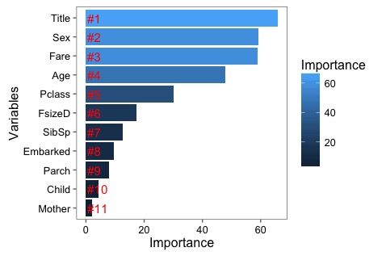

- Feature engineering
    - Missing value imputation
        - **Fare**
          - Use mean Fare
        - **Embarked**
          - Use mode Embarked (the most value among data) ’S'
          - Plot for 'Embarked vs Fare', and infer the the missing embarked info through its fare
        - **Age**, options are
          - PClass->Age
          - Title->Age:
              1. Extract title from name
              2. Fill missing age with the median in group by title
          - Predict missing Age with RF from other features
            - R package 'mice' can be used for data imputation
    - Correct weird **Fare** value 0 with the the median in group by class
    - Calculate and merge **Family Size** according to survival rate (single, small, large)
    - Find **Child & Mother** for probably ‘Child and women first'

After RF training, the feature importance can be seen as follow

